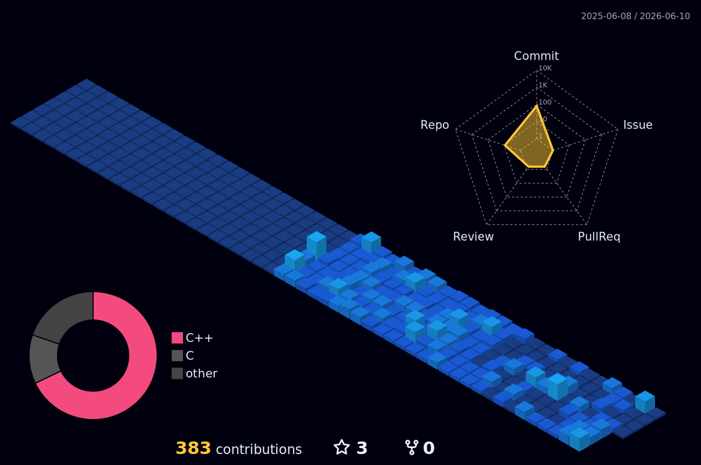

# エイゼン
# About me

- 21, Male
- College student
- Currently studying **Computer Science & Design**
- Retro nerd (early 2000s) 
- Hates CI/CD, Service models, Cloud, and other modern slop  

### **Languages and Tools:**  
  
  
and more
---
## Github Statistics

<!-- Stats & streak --->

<!--- Top Languages & Contribution Chart--->

---

