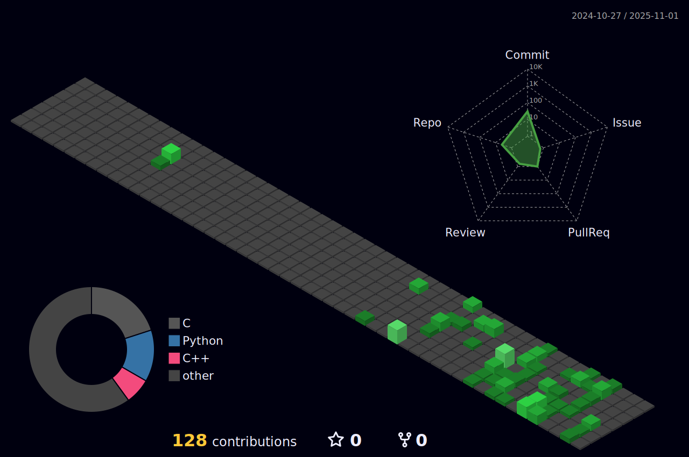

# About me
- College student
- Currently studying **Game design**
- Retro technology enthusiast (early 2000s)  

### **Languages and Tools:**  
  
  
and more
<!---->
---
## Github Statistics

<!-- 

 -->

<!-- |  | 
|-|-|
deployment paused by owner, try again later-->

